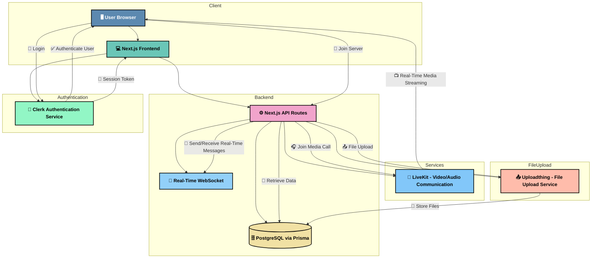

# 🎮 Discord


---

## 📖 About The Project

**Discord** is a modern, feature-packed, real-time chat application built with **Next.js**, **TypeScript**, **Prisma**, and **TailwindCSS**. This project simulates a Discord-like environment, allowing users to create and join servers, participate in text and voice channels, share media, and manage servers, all in real-time. 

With integrations like **Clerk** for authentication and **LiveKit** for media communication, **Be-A-Guptaji Discord** ensures that all real-time interactions (text, voice, video) are secure and scalable. It is designed for developers and community managers who want to create and manage online communities with ease.

---

## ✨ Key Features

- 🔑 **Clerk Authentication**: Secure login, sign-up, and session management.
- 🗣 **Real-Time Messaging**: Instant communication via **WebSocket**.
- ⚙️ **Server & Channel Management**: Create, manage, and organize servers and channels.
- 📁 **File Uploads**: Upload and share files in various channels.
- 🎥 **Media Rooms**: Audio and video communication with **LiveKit**.
- 🖼 **Dynamic User Interface**: Built with **TailwindCSS** to ensure a modern and responsive layout.
- 💬 **Text Chat**: Full-featured chat interface with emoji support, file sharing, and more.
- 🔐 **User Management**: Assign roles, create private channels, and control server access.

---

## 📸 Screenshots

### Sign-In Page


###  Create New Server


### Server DashBoard


### Real Time Chatting


### Audio Room


### Create New Channel


### Search


### Server Action


### Members List


---

## 🏗️ Architecture

The application architecture is designed for modularity, scalability, and performance. The architecture follows a **client-server** model, which is broken down as follows:

- **Frontend (Next.js + TailwindCSS)**: 
  - Handles rendering of UI components like the server dashboard, chat rooms, and media room interfaces.
  - Manages client-side routing with dynamic route handling for each server.
  - Implements state management via **Zustand** to manage app-level state.

- **Backend (Next.js API Routes)**: 
  - Handles real-time WebSocket communication and provides REST API routes for server management.
  - Processes requests for creating and managing servers, channels, and messages.

- **Authentication (Clerk)**: 
  - Ensures secure user authentication with features like social login (Google, GitHub), email-based sign-up, and session management.

- **Database (Prisma + PostgreSQL)**: 
  - Stores user data, server information, channels, messages, roles, and more using Prisma ORM connected to PostgreSQL.

- **Real-Time Communication (LiveKit)**:
  - Manages real-time audio and video communication in media rooms (video chat).



---

## 🛠 Built With

- **Frontend**: Next.js 15, TypeScript, TailwindCSS
- **Backend**: Prisma ORM, PostgreSQL
- **Authentication**: Clerk
- **Real-Time Communication**: WebSocket, LiveKit
- **State Management**: Zustand
- **File Uploads**: Uploadthing

---

## ⚙️ Getting Started

### Prerequisites

Make sure you have the following installed:

- **Node.js 18+**
- **PostgreSQL** (for database)
- **Clerk API Key** (for user authentication)
- **LiveKit API Key** (for real-time media rooms)

### Installation

1. **Clone the repository**:

```bash
git clone https://github.com/username/be-a-guptaji-discord.git
cd be-a-guptaji-discord
```

2. **Install the dependencies**:

```bash
npm install
```

3. **Configure environment variables**:

Create a `.env.local` file and set the following variables:

```env
DATABASE_URL=your_postgres_connection_string
CLERK_API_KEY=your_clerk_api_key
LIVEKIT_API_KEY=your_livekit_api_key
```

4. **Set up the database**:

Install Prisma and apply the migrations to set up your database.

```bash
npm install prisma --save-dev
npx prisma init
npx prisma migrate dev
npx prisma generate
```

5. **Run the application**:

```bash
npm run dev
```

Visit [http://localhost:3000](http://localhost:3000) to interact with the application.

---

## 📁 Directory Structure

The project is organized as follows:

```
Directory structure:
└──  discord/
    ├── README.md
    ├── components.json
    ├── eslint.config.mjs
    ├── LICENSE
    ├── middleware.ts
    ├── next.config.ts
    ├── package.json
    ├── postcss.config.mjs
    ├── tsconfig.json
    ├── types.ts
    ├── .env.samples
    ├── .prettierignore
    ├── .prettierrc.json
    ├── app/
    │   ├── globals.css
    │   ├── layout.tsx
    │   ├── not-found.tsx
    │   ├── (auth)/
    │   │   ├── layout.tsx
    │   │   └── (routes)/
    │   │       ├── sign-in/
    │   │       │   └── [[...sign-in]]/
    │   │       │       └── page.tsx
    │   │       └── sign-up/
    │   │           └── [[...sign-up]]/
    │   │               └── page.tsx
    │   ├── (invite)/
    │   │   └── (routes)/
    │   │       └── invite/
    │   │           └── [inviteCode]/
    │   │               └── page.tsx
    │   ├── (main)/
    │   │   ├── layout.tsx
    │   │   └── (routes)/
    │   │       └── server/
    │   │           └── [serverID]/
    │   │               ├── layout.tsx
    │   │               ├── page.tsx
    │   │               ├── channel/
    │   │               │   └── [channelID]/
    │   │               │       └── page.tsx
    │   │               └── conversation/
    │   │                   └── [memberID]/
    │   │                       └── page.tsx
    │   ├── (setup)/
    │   │   └── page.tsx
    │   └── api/
    │       ├── channels/
    │       │   ├── route.ts
    │       │   └── [channelID]/
    │       │       └── route.ts
    │       ├── directMessages/
    │       │   └── route.ts
    │       ├── members/
    │       │   └── [memberID]/
    │       │       └── route.ts
    │       ├── messages/
    │       │   └── route.ts
    │       ├── servers/
    │       │   ├── route.ts
    │       │   └── [serverID]/
    │       │       ├── route.ts
    │       │       ├── invite-code/
    │       │       │   └── route.ts
    │       │       └── leave/
    │       │           └── route.ts
    │       ├── token/
    │       │   └── route.ts
    │       └── uploadthing/
    │           ├── core.ts
    │           └── route.ts
    ├── components/
    │   ├── actionToolTip.tsx
    │   ├── emojiPicker.tsx
    │   ├── fileUpload.tsx
    │   ├── mediaRoom.tsx
    │   ├── mobileToggle.tsx
    │   ├── modeToggle.tsx
    │   ├── socketIndicator.tsx
    │   ├── userAvatar.tsx
    │   ├── chat/
    │   │   ├── chatHeader.tsx
    │   │   ├── chatInput.tsx
    │   │   ├── chatItem.tsx
    │   │   ├── chatMessage.tsx
    │   │   ├── chatVideoButton.tsx
    │   │   └── chatWelcome.tsx
    │   ├── modals/
    │   │   ├── createChannelModal.tsx
    │   │   ├── createServerModal.tsx
    │   │   ├── deleteChannelModal.tsx
    │   │   ├── deleteMessageModal.tsx
    │   │   ├── deleteServerModal.tsx
    │   │   ├── editChannelModal.tsx
    │   │   ├── editServerModal.tsx
    │   │   ├── initialModal.tsx
    │   │   ├── inviteModal.tsx
    │   │   ├── leaveServerModal.tsx
    │   │   ├── membersModal.tsx
    │   │   └── messageFileModal.tsx
    │   ├── navigation/
    │   │   ├── navigationAction.tsx
    │   │   ├── navigationItem.tsx
    │   │   └── navigationSidebar.tsx
    │   ├── providers/
    │   │   ├── modalProvider.tsx
    │   │   ├── queryProvider.tsx
    │   │   ├── socketProvider.tsx
    │   │   └── themeProvider.tsx
    │   ├── server/
    │   │   ├── serverChannel.tsx
    │   │   ├── serverHeader.tsx
    │   │   ├── serverMember.tsx
    │   │   ├── serverSearch.tsx
    │   │   ├── serverSection.tsx
    │   │   └── serverSidebar.tsx
    │   └── ui/
    │       ├── avatar.tsx
    │       ├── badge.tsx
    │       ├── button.tsx
    │       ├── command.tsx
    │       ├── dialog.tsx
    │       ├── dropdown-menu.tsx
    │       ├── form.tsx
    │       ├── input.tsx
    │       ├── label.tsx
    │       ├── popover.tsx
    │       ├── scroll-area.tsx
    │       ├── select.tsx
    │       ├── separator.tsx
    │       ├── sheet.tsx
    │       └── tooltip.tsx
    ├── hooks/
    │   ├── useChatQuery.ts
    │   ├── useChatScroll.ts
    │   ├── useChatSocket.ts
    │   ├── useModal.ts
    │   └── useOrigin.ts
    ├── lib/
    │   ├── conversation.ts
    │   ├── currentProfile.ts
    │   ├── currentProfilePages.ts
    │   ├── db.ts
    │   ├── initialProfile.ts
    │   ├── uploadthing.ts
    │   ├── utils.ts
    │   └── generated/
    │       └── prisma/
    │           └── client/
    │               ├── client.d.ts
    │               ├── client.js
    │               ├── default.d.ts
    │               ├── default.js
    │               ├── edge.d.ts
    │               ├── edge.js
    │               ├── index-browser.js
    │               ├── index.js
    │               ├── package.json
    │               ├── schema.prisma
    │               ├── wasm.d.ts
    │               ├── wasm.js
    │               └── runtime/
    │                   └── index-browser.d.ts
    ├── pages/
    │   └── api/
    │       └── socket/
    │           ├── io.ts
    │           ├── directMessages/
    │           │   ├── [directMessageID].ts
    │           │   └── index.ts
    │           └── messages/
    │               ├── [messageID].ts
    │               └── index.ts
    └── prisma/
        └── schema.prisma

```

### Key Folders and Files:

- **/components**: Contains reusable components like chat input, server sidebar, message display, etc.
- **/pages**: Includes the main routes for pages like login, chat, and server pages.
- **/api**: Server-side route handlers for database interactions and real-time communication.
- **/prisma**: Prisma schema and client for database interaction.
- **/styles**: TailwindCSS styles and global styling.

---

## 🔐 Authentication

The application uses **Clerk** for handling user authentication, including login, signup, and session management. Clerk supports social login providers like Google, GitHub, and more. It simplifies handling user authentication and ensures secure access to your application.

---

## 🚀 Real-Time Communication

The **LiveKit** integration powers video and audio communication in media rooms. The application allows users to host video calls, making it more than just a text-based chat system.

- **WebSocket**: The app uses WebSocket to send real-time messages between users and chat rooms.
- **LiveKit**: Provides support for video/audio communication, enabling users to join live media rooms and interact in real-time.

---

## 🛣️ Roadmap

- [x] User Authentication with Clerk
- [x] Real-Time Messaging with WebSocket
- [x] Media Rooms with LiveKit
- [ ] Team Collaboration Support
- [ ] Channel Management Enhancements
- [ ] Export to PDF/HTML

---

## 📜 License

MIT License © 2025 Aryan Baadlas

---

## 📬 Contact

👨‍💻 **Aryan Baadlas**  
📧 **aryanbaadlas@gmail.com**

---

### ⭐ Show some love!

If you like this project, **give it a star ⭐ on GitHub**!
